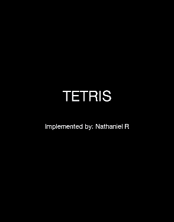

# Python Tetris Game with pygame

Originally inspired by [GitHub Project - educ8s/Python-Tetris-Game-Pygame](https://github.com/educ8s/Python-Tetris-Game-Pygame).



This implementation was re-written with the intent of using it for teaching beginners how to code. Tested on Mac and Windows.

## Installing + Running the game

Go to [the official Python Website](https://www.python.org/downloads/) and download Python for your machine.

Next, install the `pygame` module from the terminal:

```bash
python -m pip install pygame
```

### Run with VSCode

We recommend you use VSCode to run the game. Even if your computer is old, you should be able to download an older version of VSCode.

Install the [Python Debugging Extension from VSCode](https://marketplace.visualstudio.com/items?itemName=ms-python.debugpy). Finally, go to the `Run and Debug` panel on the left, and click the `Play Tetris` green play button to launch the game.

### Run with the terminal

If you cannot run the Python Debugger Extension on VSCode (because your computer is too old), run the game from the terminal using this command:

```bash
PYTHONPATH=src python main.py
```

### Troubleshooting

On Mac, you **do not** need to install xcode tools to install anything. If you know you installed Python but `python` on the terminal doesn't work, you might need to add it to your path with this terminal command (it must end with `bin`):

```bash
echo 'export PYTHON=/path/to/install/location/bin' >> ~/.bashrc
```

On Windows, the easiest way to download Python is by **first** downloading the Python Debugger Extension, and using the VSCode welcome steps to install Python from the windows store.

On VSCode, if `Python: Select Interpreter` does not find your installed Python version, try running `Python: Clear Cache And Reload Window`.

## Playing the game

* `↓ → ←` - move the block
* `↑` - hard drop
* `r` - rotate
* `h` - hold the block

## Solutions

Solutions to the questions are available on the [`coding-solutions` branch of this repo](https://github.com/NathanielRN/Python-Tetris-Game-Pygame/tree/coding-solutions).